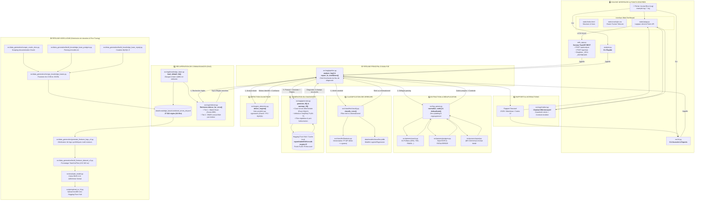

# 🚀 Architecture Globale du Pipeline RAG Multi-Moteurs

```mermaid
flowchart TB
    %% ==========================================
    %% 1. ENTRÉE ET INTERFACES
    %% ==========================================
    subgraph UI_TIER ["🖥️ COUCHE INTERFACES & POINTS D'ENTRÉE"]
        RAW_LOG["📄 Fichier Journal Brut (Log)<br/>example.log / *.log"]
        
        subgraph FRONTEND ["Interface Web Dashboard"]
            HTML["static/index.html<br/>Structure & Vues"]
            CSS["static/css/style.css<br/>Charte Tunisie Telecom"]
            JS["static/js/app.js<br/>Logique client & Fetch API"]
        end

        WEB_APP["web_app.py<br/><b>Serveur FastAPI REST</b><br/>• POST /api/analyze<br/>• POST /api/chat<br/>• Singleton _KB & _RETRIEVER"]
        CLI_ANALYZE["analyze.py<br/><b>CLI Rapide</b>"]
        CLI_MAIN["src/cli.py<br/><b>CLI Avancée & Exports</b>"]
    end

    RAW_LOG --> JS
    JS -->|HTTP POST| WEB_APP
    RAW_LOG -->|CLI| CLI_ANALYZE
    RAW_LOG -->|CLI| CLI_MAIN

    %% ==========================================
    %% 2. ORCHESTRATEUR PRINCIPAL
    %% ==========================================
    subgraph ORCHESTRATOR ["⚙️ PIPELINE PRINCIPAL D'ANALYSE"]
        PIPELINE["src/rag/pipeline.py<br/><b>analyze_log() & report_to_markdown()</b><br/><i>Chef d'orchestre du flux de diagnostic</i>"]
    end

    WEB_APP -->|Appelle| PIPELINE
    CLI_ANALYZE -->|Appelle| PIPELINE
    CLI_MAIN -->|Appelle| PIPELINE

    %% ==========================================
    %% 3. ÉTAPE 1 : DÉTECTION DU MOTEUR
    %% ==========================================
    subgraph ENGINE_DETECT ["1️⃣ DÉTECTION DU MOTEUR"]
        DETECT["src/engine_detection.py<br/><b>detect_engine()</b><br/><i>Vote pondéré par signatures (Oracle / PG / MySQL)</i>"]
    end

    PIPELINE -->|1. Analyse brute| DETECT
    DETECT -->|Moteur identifié + Confiance| PIPELINE

    %% ==========================================
    %% 4. ÉTAPE 2 : PARSING & NORMALISATION
    %% ==========================================
    subgraph PARSING ["2️⃣ EXTRACTION & DÉDUPLICATION"]
        PARSER_FACADE["src/log_parser.py<br/><b>normalize_code() & deduplicate()</b><br/><i>Zero-padding & regroupement</i>"]
        
        P_ORA["src/parsers/oracle.py<br/>81 Préfixes (ORA, TNS, RMAN...)"]
        P_PG["src/parsers/postgres.py<br/>SQLSTATE & FATAL/ERROR"]
        P_MY["src/parsers/mysql.py<br/>[MY-XXXXXX] & format hérité"]
    end

    PIPELINE -->|2. Délègue parsing| PARSER_FACADE
    PARSER_FACADE --> P_ORA
    PARSER_FACADE --> P_PG
    PARSER_FACADE --> P_MY
    P_ORA --> PARSER_FACADE
    P_PG --> PARSER_FACADE
    P_MY --> PARSER_FACADE
    PARSER_FACADE -->|Codes uniques + Contexte| PIPELINE

    %% ==========================================
    %% 5. ÉTAPE 3 : CLASSIFICATION
    %% ==========================================
    subgraph CLASSIFICATION ["3️⃣ CLASSIFICATION DES ERREURS"]
        CLASSIFIER["src/classifier/classify.py<br/><b>classify_error()</b><br/><i>Filtre réel vs informationnel</i>"]
        FEATS["src/classifier/features.py<br/><i>Vectorisation TF-IDF (Mots + n-grams)</i>"]
        MODEL_JOB["data/models/classifier.joblib<br/><i>Modèle LogisticRegression</i>"]
    end

    PIPELINE -->|3. Vérifie sévérité| CLASSIFIER
    CLASSIFIER --> FEATS
    CLASSIFIER --> MODEL_JOB
    CLASSIFIER -->|Réel ou Informationnel| PIPELINE

    %% ==========================================
    %% 6. ÉTAPE 4 : RÉCUPÉRATION RAG (RETRIEVAL)
    %% ==========================================
    subgraph RETRIEVAL_LAYER ["4️⃣ RÉCUPÉRATION DE CONNAISSANCES (RAG)"]
        KB_LOADER["src/rag/knowledge_base.py<br/><b>load_default_kb()</b><br/><i>Charge la base unifiée en mémoire</i>"]
        KB_FILE[("data/knowledge_base/combined_errors_kb.jsonl<br/><b>27 622 règles (9.8 Mo)</b>")]
        
        RETRIEVER["src/rag/retriever.py<br/><b>Retriever.retrieve_for_error()</b><br/>• Tier 1 : Match Exact (Score=999)<br/>• Tier 2 : BM25 Lexical filtré par moteur"]
    end

    KB_LOADER --> KB_FILE
    KB_LOADER --> RETRIEVER
    PIPELINE -->|4. Recherche règles| RETRIEVER
    RETRIEVER -->|Top-k Règles enrichies| PIPELINE

    %% ==========================================
    %% 7. ÉTAPE 5 : GÉNÉRATION & GARDE-FOUS
    %% ==========================================
    subgraph GENERATION_LAYER ["5️⃣ GÉNÉRATION DU DIAGNOSTIC"]
        GENERATOR["src/rag/generator.py<br/><b>generate_t5() & warmup_t5()</b><br/>• Court-circuit déterministe (Exact Match)<br/>• Inférence Seq2Seq FLAN-T5<br/>• Filtre répétition & anti-hallucination"]
        T5_MODEL[("Hugging Face Hub / Cache local<br/><b>rayenthabet004/tt-multi-engine-t5</b><br/><i>Poids FLAN-T5 fine-tuné</i>")]
    end

    PIPELINE -->|5. Prompt + Contexte + Règles| GENERATOR
    GENERATOR --> T5_MODEL
    T5_MODEL --> GENERATOR
    GENERATOR -->|Diagnostic 4 champs structurés| PIPELINE

    %% ==========================================
    %% 8. ÉTAPE 6 : RAPPORT & CHATBOT
    %% ==========================================
    subgraph OUTPUT_LAYER ["6️⃣ RAPPORTS & INTERACTIONS"]
        REPORT_DICT["Rapport Structuré<br/><i>JSON / Markdown / Cartes UI</i>"]
        CHATBOT["src/rag/chatbot.py<br/><b>Chatbot DBA Interactif</b><br/><i>Guardrails stricts + Contexte incident</i>"]
    end

    PIPELINE --> REPORT_DICT
    REPORT_DICT --> JS
    REPORT_DICT --> CLI_MAIN
    JS --> CHATBOT
    CHATBOT --> JS

    %% ==========================================
    %% 9. PIPELINE HORS-LIGNE (DATA & TRAINING)
    %% ==========================================
    subgraph OFFLINE_PIPELINE ["🛠️ PIPELINE HORS-LIGNE (Génération de données & Fine-Tuning)"]
        direction TB
        SCRAPE_ORA["src/data_generation/scrape_oracle_docs.py<br/><i>Scraping documentation Oracle</i>"]
        BUILD_PG["src/data_generation/build_knowledge_base_postgres.py<br/><i>Parsing errcodes.txt</i>"]
        BUILD_MY["src/data_generation/build_knowledge_base_mysql.py<br/><i>Curation MySQL 8</i>"]
        MERGE_KB["src/data_generation/merge_knowledge_bases.py<br/><i>Fusionne les 3 KB en JSONL</i>"]
        
        GEN_SYNTH["src/data_generation/generate_finetune_logs_v2.py<br/><i>Générateur de logs synthétiques multi-moteurs</i>"]
        BUILD_DS["src/data_generation/build_finetune_dataset_v2.py<br/><i>Formatage Train/Val/Test (101 540 ex)</i>"]
        EVAL["src/evaluate_model.py<br/><i>Calcul BLEU-4 & Adhérence format</i>"]
        HF_UPLOAD["scripts/upload_to_hf.py<br/><i>Upload modèle vers Hugging Face Hub</i>"]

        SCRAPE_ORA --> MERGE_KB
        BUILD_PG --> MERGE_KB
        BUILD_MY --> MERGE_KB
        MERGE_KB --> KB_FILE
        KB_FILE --> GEN_SYNTH
        GEN_SYNTH --> BUILD_DS
        BUILD_DS --> EVAL
        EVAL --> HF_UPLOAD
    end
```
