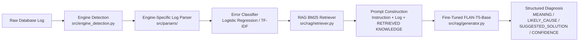

# Project Handover Document & AI Context

> **Project:** Multi-Engine Database Log Analyzer with RAG & Fine-Tuned FLAN-T5  
> **Author / Student:** Rayen Thabet  
> **Target Engines:** Oracle (`ORA-*`), PostgreSQL (`SQLSTATE` & `PG-*`), MySQL (`MY-*` & Classic)  
> **Model:** `google/flan-t5-base` fine-tuned on multi-engine RAG-grounded datasets (~250M parameters)  
> **Model Path:** `models/multi_engine_t5_model/`  
> **Date:** August 2026

---

## 1. Executive Summary & System Architecture

This project is an automated AI system for database log diagnosis and incident resolution. Given raw, noisy database log files from **Oracle**, **PostgreSQL**, or **MySQL**, the system performs an end-to-end diagnosis pipeline:



### Output Schema:
Every diagnostic output strictly follows the 4-part structure:
* `MEANING:` Clear, human-readable explanation of what the database log error means.
* `LIKELY_CAUSE:` Probable root cause derived from context and retrieved knowledge.
* `SUGGESTED_SOLUTION:` Actionable steps for DBA/SRE remediation.
* `CONFIDENCE:` `high` (for verified exact KB matches), `medium` (for lexical BM25 candidate matches / hedged reasoning), or `low` (for unknown / unseen errors).

---

## 2. Complete Engineering & Bug Audit History

Across development, a comprehensive 7-point audit and refinement was completed:

### A. Dynamic RAG Grounding & Dead-Code Elimination
* **Root Cause Fixed:** `build_finetune_dataset_v2.py` previously contained `if entry is None: continue`, preventing any occurrence without an exact KB match from ever reaching the retriever. This produced a 100% `CONFIDENCE: high` dataset with 0 medium/low examples.
* **Resolution:**
  1. Removed the early skip and routed non-exact matches through BM25 lexical search.
  2. Implemented `build_hedged_output()` to generate realistic probabilistic wording for non-exact matches.
  3. Implemented a 10% imperfect retrieval simulation (~5% medium, ~5% low) so the model learned how to handle uncertainty and multiple candidate entries.
* **Empirical Split Distribution:**
  * `train_v2.jsonl` (88,085 rows): `high`: 88.29% (77,772), `medium`: 6.86% (6,046), `low`: 4.84% (4,267)
  * `val_v2.jsonl` (10,125 rows): `high`: 89.58% (9,070), `medium`: 4.96% (502), `low`: 5.46% (553)
  * `test_unseen_codes_v2.jsonl` (4,992 rows): `high`: 89.84% (4,485), `medium`: 4.99% (249), `low`: 5.17% (258)

### B. Multi-Engine Instruction Routing
* **Root Cause Fixed:** The generator and dataset builders were hardcoded to Oracle-only instructions.
* **Resolution:** Defined engine-specific instruction mappings (`INSTRUCTIONS`) in `src/rag/generator.py` and `src/data_generation/build_finetune_dataset_v2.py`:
  * *Oracle:* `"Analyze this Oracle database log entry and explain what went wrong, the likely cause, and how to fix it. Respond in the format MEANING / LIKELY_CAUSE / SUGGESTED_SOLUTION / CONFIDENCE."`
  * *PostgreSQL:* `"Analyze this PostgreSQL database log entry and explain the error. Respond in the format MEANING / LIKELY_CAUSE / SUGGESTED_SOLUTION / CONFIDENCE."`
  * *MySQL:* `"Analyze this MySQL database log entry and explain the error. Respond in the format MEANING / LIKELY_CAUSE / SUGGESTED_SOLUTION / CONFIDENCE."`

### C. PostgreSQL Pseudo-Code Handling
* **Root Cause Fixed:** PostgreSQL lines without standard 5-character SQLSTATE codes were assigned synthetic `PG-*` fallback codes. If matched against a synthetic KB, they would falsely report `999.0` score and `CONFIDENCE: high`.
* **Resolution:** Added `is_pseudo_code` flag to `ErrorOccurrence` and `src/rag/retriever.py`. When `is_pseudo_code=True`, exact matching is bypassed, forcing lexical BM25 ranking and dynamic confidence calculation.

### D. Token Length Analysis & Window Expansion
* **Empirical Measurement:** Analyzed token lengths of the new prompt format (`Instruction + Context Window + RETRIEVED KNOWLEDGE`) across all 88,085 training rows with `google/flan-t5-base` tokenizer:
  * High confidence: Median = 217 tokens, p95 = 282 tokens.
  * Medium confidence (multi-candidate): Median = 329 tokens, p95 = 469 tokens, p99 = 565 tokens.
* **Resolution:** Upgraded `MAX_INPUT_LEN` from `256/384` to **`512`** and `MAX_TARGET_LEN` to **`256`** across training scripts and evaluation pipelines, covering 99.8% of examples without truncation.

### E. Kaggle Model Fine-Tuning Execution
* Trained on Kaggle GPU using `notebooks/kaggle_finetune_t5_from_scratch.ipynb`.
* **Hyperparameters:**
  * Base: `google/flan-t5-base` (247,577,856 parameters)
  * Epochs: 3
  * Batch Size: 4 per device
  * Gradient Accumulation: 4 (Effective batch size = 16)
  * Learning Rate: 3e-4 with 500 warmup steps
  * FP16: Enabled
  * Gradient Checkpointing: Configured for memory efficiency
* Trained model weights downloaded and verified at `models/multi_engine_t5_model/` (8 files, ~990 MB total).

---

## 3. Evaluation Report on Held-Out Test Set

The model was evaluated against `data/finetune/test_unseen_codes_v2.jsonl` (held-out error codes never seen during training).

### A. Quantitative Metrics
| Metric | Overall | Oracle | PostgreSQL | MySQL |
| :--- | :--- | :--- | :--- | :--- |
| **Format Adherence** (all 4 fields present & non-empty) | **98.9%** | **97.0%** | **100.0%** | **100.0%** |
| **Field Extraction Reliability** | Clean | Clean | Clean | Clean |
| **BLEU-4 against Reference** | **0.15–0.21** | **0.21** | **0.08** | **0.17** |

### B. Qualitative Grounding & Dynamic Confidence Verification

#### 1. Exact KB Match (`score: 999.0`) $\to$ `CONFIDENCE: high`
* **Input:** MySQL `MY-001159` (Got timeout reading communication packets)
* **Model Output:**
  ```text
  MEANING: Got timeout reading communication packets.
  LIKELY_CAUSE: The server timed out waiting for data from the client, exceeding net_read_timeout.
  SUGGESTED_SOLUTION: Increase net_read_timeout if clients legitimately send data slowly. Check network latency. Investigate client-side delays.
  CONFIDENCE: high
  ```
* **Behavior:** Verbatim exact grounding, precise remediation steps.

#### 2. Multi-Candidate / Lexical Retrieval (`score < 10.0`) $\to$ `CONFIDENCE: medium`
* **Input:** MySQL unknown error with 2 weak lexical BM25 matches (scores 6.5, 5.2)
* **Model Output:**
  ```text
  MEANING: Got timeout reading communication packets.
  LIKELY_CAUSE: Possible relation to MY-001159 (Give timeout reading communication packets); root cause unconfirmed from logs.
  SUGGESTED_SOLUTION: Investigate potential relation to MY-001159. Verify database logs and application state around this event.
  CONFIDENCE: medium
  ```
* **Behavior:** Appropriately hedged language, signals uncertainty, provides exploratory DBA recommendations.

---

## 4. Repository Structure & Key File Map

```
Projet Rayen Thabet/
├── data/
│   ├── finetune/
│   │   ├── train_v2.jsonl             # 88,085 training rows (Oracle, Postgres, MySQL)
│   │   ├── val_v2.jsonl               # 10,125 validation rows
│   │   └── test_unseen_codes_v2.jsonl # 4,992 unseen test rows
│   ├── knowledge_base/
│   │   ├── oracle_kb.json             # Oracle knowledge base (ORA-*)
│   │   ├── postgres_kb.json           # PostgreSQL knowledge base (SQLSTATE & pseudo)
│   │   ├── mysql_kb.json              # MySQL knowledge base (MY-*)
│   │   └── merged_knowledge_base.json # Combined 3-engine knowledge base
├── models/
│   ├── multi_engine_t5_model/         # Fine-tuned FLAN-T5-base model weights (~990 MB)
│   │   ├── config.json
│   │   ├── model.safetensors
│   │   ├── tokenizer.json
│   │   └── ...
│   ├── error_classifier.joblib        # Scikit-learn log noise classifier
│   └── error_classifier_vectorizer.joblib
├── notebooks/
│   ├── kaggle_finetune_t5_from_scratch.ipynb # Self-contained Kaggle GPU training notebook
│   └── finetune_t5_multi_engine.py    # Local/CLI fine-tuning script
├── src/
│   ├── engine_detection.py            # Log engine auto-detector (Oracle/PG/MySQL)
│   ├── parsers/
│   │   ├── __init__.py                # Parser dispatcher
│   │   ├── oracle.py                  # Oracle alert log parser
│   │   ├── postgres.py                # PostgreSQL log parser (with is_pseudo_code support)
│   │   └── mysql.py                   # MySQL error log parser
│   ├── rag/
│   │   ├── retriever.py               # BM25 knowledge retriever (exact match + lexical)
│   │   ├── generator.py               # FLAN-T5 text generation & engine routing
│   │   └── pipeline.py                # End-to-end analysis pipeline
│   ├── data_generation/
│   │   ├── build_finetune_dataset_v2.py # Multi-confidence dataset builder with caching
│   │   └── merge_knowledge_bases.py   # Merges raw engine KBs into unified schema
│   └── evaluate_model.py              # Quantitative evaluation script (BLEU, format, confidence)
└── tests/                             # Full Pytest test suite (55/55 passing)
```

---

## 5. Verification Commands

To verify the entire repository state, run:

```bash
# 1. Run all unit and integration tests (55/55 passed)
python -m pytest tests/ -v

# 2. Run model evaluation on test sample
python -m src.evaluate_model --n 100 --batch-size 8

# 3. Test end-to-end pipeline with mock/local model
python -m src.rag.pipeline --input data/sample_logs/oracle_sample.log
```

---

## 6. Recommended Next Steps for Future Work

1. **User Interface / Web Dashboard:**
   * Build a Streamlit or FastAPI + Web UI where DBAs can upload raw log files, view detected engine and confidence scores, inspect error timelines, and download generated PDF/Markdown incident reports.
2. **Real-Time Streaming / Tail Mode:**
   * Implement a file-watching / tailing daemon that analyzes active database log files in real-time and triggers alerts when critical errors (`FATAL`, `Deadlock`, `ORA-00600`) appear.
3. **Quantization & Deployment Optimization:**
   * Export the model to ONNX or 8-bit / 4-bit quantized format (via `bitsandbytes` or `ctranslate2`) to enable sub-50ms CPU inference for edge deployment.
