# 🚀 Tunisie Telecom — Database Log AI Triage Suite

> **Plateforme intelligente de diagnostic et triage automatisé de logs de bases de données hétérogènes (Oracle, PostgreSQL, MySQL) par Génération Augmentée par Récupération (RAG Multi-Moteurs).**

[](https://www.python.org/downloads/)
[](https://fastapi.tiangolo.com)
[](https://pytorch.org/)
[](https://huggingface.co/rayenthabet004/tt-multi-engine-t5)
[](https://github.com/rayenthabet004-spec/Projet-TT)
[](https://projet-tt-production.up.railway.app)

---

## 📌 Présentation du Projet

Dans les environnements critiques comme ceux de **Tunisie Telecom (DCSI - Centre IT Kasbah)**, les serveurs de bases de données produisent quotidiennement des dizaines de milliers de lignes de journaux (*alert logs*). L'analyse manuelle par les équipes DBA est fastidieuse, sujette aux omissions et compliquée par la coexistence de moteurs hétérogènes.

Ce projet apporte une solution complète et autonome :
1. **Détection automatique du moteur SGBD** (Oracle, PostgreSQL, MySQL) via heuristiques pondérées.
2. **Parsing & Normalisation** couvrant 81 préfixes d'erreurs et extraction de contexte.
3. **Classification intelligente** (TF-IDF + Régression Logistique) pour éliminer le bruit informationnel bénin (*log switches*, *checkpoints*).
4. **Récupération de connaissances (RAG)** sur une base unifiée de **27 622 règles** avec l'algorithme BM25 et court-circuit déterministe pour les correspondances exactes.
5. **Génération de diagnostics fiables** via un modèle **FLAN-T5 fine-tuné** (250M paramètres), avec ancrage strict (*grounding*) et garde-fous anti-hallucinations.
6. **Dashboard Web & Chatbot DBA Interactif** aux couleurs de Tunisie Telecom.

---

## 🏗️ Architecture Globale du Pipeline

```mermaid
flowchart TB
    %% ==========================================
    %% 1. ENTRÉE ET INTERFACES
    %% ==========================================
    subgraph UI_TIER ["🖥️ COUCHE INTERFACES & POINTS D'ENTRÉE"]
        RAW_LOG["📄 Fichier Journal Brut (Log)<br/>example.log / *.log"]
        
        subgraph FRONTEND ["Interface Web Dashboard"]
            HTML["static/index.html<br/>Structure & Vues"]
            CSS["static/css/style.css<br/>Charte Tunisie Telecom"]
            JS["static/js/app.js<br/>Logique client & Fetch API"]
        end

        WEB_APP["web_app.py<br/><b>Serveur FastAPI REST</b><br/>• POST /api/analyze<br/>• POST /api/chat<br/>• Singleton _KB & _RETRIEVER"]
        CLI_ANALYZE["analyze.py<br/><b>CLI Rapide</b>"]
        CLI_MAIN["src/cli.py<br/><b>CLI Avancée & Exports</b>"]
    end

    RAW_LOG --> JS
    JS -->|HTTP POST| WEB_APP
    RAW_LOG -->|CLI| CLI_ANALYZE
    RAW_LOG -->|CLI| CLI_MAIN

    %% ==========================================
    %% 2. ORCHESTRATEUR PRINCIPAL
    %% ==========================================
    subgraph ORCHESTRATOR ["⚙️ PIPELINE PRINCIPAL D'ANALYSE"]
        PIPELINE["src/rag/pipeline.py<br/><b>analyze_log() & report_to_markdown()</b><br/><i>Chef d'orchestre du flux de diagnostic</i>"]
    end

    WEB_APP -->|Appelle| PIPELINE
    CLI_ANALYZE -->|Appelle| PIPELINE
    CLI_MAIN -->|Appelle| PIPELINE

    %% ==========================================
    %% 3. ÉTAPE 1 : DÉTECTION DU MOTEUR
    %% ==========================================
    subgraph ENGINE_DETECT ["1️⃣ DÉTECTION DU MOTEUR"]
        DETECT["src/engine_detection.py<br/><b>detect_engine()</b><br/><i>Vote pondéré par signatures (Oracle / PG / MySQL)</i>"]
    end

    PIPELINE -->|1. Analyse brute| DETECT
    DETECT -->|Moteur identifié + Confiance| PIPELINE

    %% ==========================================
    %% 4. ÉTAPE 2 : PARSING & NORMALISATION
    %% ==========================================
    subgraph PARSING ["2️⃣ EXTRACTION & DÉDUPLICATION"]
        PARSER_FACADE["src/log_parser.py<br/><b>normalize_code() & deduplicate()</b><br/><i>Zero-padding & regroupement</i>"]
        
        P_ORA["src/parsers/oracle.py<br/>81 Préfixes (ORA, TNS, RMAN...)"]
        P_PG["src/parsers/postgres.py<br/>SQLSTATE & FATAL/ERROR"]
        P_MY["src/parsers/mysql.py<br/>[MY-XXXXXX] & format hérité"]
    end

    PIPELINE -->|2. Délègue parsing| PARSER_FACADE
    PARSER_FACADE --> P_ORA
    PARSER_FACADE --> P_PG
    PARSER_FACADE --> P_MY
    P_ORA --> PARSER_FACADE
    P_PG --> PARSER_FACADE
    P_MY --> PARSER_FACADE
    PARSER_FACADE -->|Codes uniques + Contexte| PIPELINE

    %% ==========================================
    %% 5. ÉTAPE 3 : CLASSIFICATION
    %% ==========================================
    subgraph CLASSIFICATION ["3️⃣ CLASSIFICATION DES ERREURS"]
        CLASSIFIER["src/classifier/classify.py<br/><b>classify_error()</b><br/><i>Filtre réel vs informationnel</i>"]
        FEATS["src/classifier/features.py<br/><i>Vectorisation TF-IDF (Mots + n-grams)</i>"]
        MODEL_JOB["data/models/classifier.joblib<br/><i>Modèle LogisticRegression</i>"]
    end

    PIPELINE -->|3. Vérifie sévérité| CLASSIFIER
    CLASSIFIER --> FEATS
    CLASSIFIER --> MODEL_JOB
    CLASSIFIER -->|Réel ou Informationnel| PIPELINE

    %% ==========================================
    %% 6. ÉTAPE 4 : RÉCUPÉRATION RAG (RETRIEVAL)
    %% ==========================================
    subgraph RETRIEVAL_LAYER ["4️⃣ RÉCUPÉRATION DE CONNAISSANCES (RAG)"]
        KB_LOADER["src/rag/knowledge_base.py<br/><b>load_default_kb()</b><br/><i>Charge la base unifiée en mémoire</i>"]
        KB_FILE[("data/knowledge_base/combined_errors_kb.jsonl<br/><b>27 622 règles (9.8 Mo)</b>")]
        
        RETRIEVER["src/rag/retriever.py<br/><b>Retriever.retrieve_for_error()</b><br/>• Tier 1 : Match Exact (Score=999)<br/>• Tier 2 : BM25 Lexical filtré par moteur"]
    end

    KB_LOADER --> KB_FILE
    KB_LOADER --> RETRIEVER
    PIPELINE -->|4. Recherche règles| RETRIEVER
    RETRIEVER -->|Top-k Règles enrichies| PIPELINE

    %% ==========================================
    %% 7. ÉTAPE 5 : GÉNÉRATION & GARDE-FOUS
    %% ==========================================
    subgraph GENERATION_LAYER ["5️⃣ GÉNÉRATION DU DIAGNOSTIC"]
        GENERATOR["src/rag/generator.py<br/><b>generate_t5() & warmup_t5()</b><br/>• Court-circuit déterministe (Exact Match)<br/>• Inférence Seq2Seq FLAN-T5<br/>• Filtre répétition & anti-hallucination"]
        T5_MODEL[("Hugging Face Hub / Cache local<br/><b>rayenthabet004/tt-multi-engine-t5</b><br/><i>Poids FLAN-T5 fine-tuné</i>")]
    end

    PIPELINE -->|5. Prompt + Contexte + Règles| GENERATOR
    GENERATOR --> T5_MODEL
    T5_MODEL --> GENERATOR
    GENERATOR -->|Diagnostic 4 champs structurés| PIPELINE

    %% ==========================================
    %% 8. ÉTAPE 6 : RAPPORT & CHATBOT
    %% ==========================================
    subgraph OUTPUT_LAYER ["6️⃣ RAPPORTS & INTERACTIONS"]
        REPORT_DICT["Rapport Structuré<br/><i>JSON / Markdown / Cartes UI</i>"]
        CHATBOT["src/rag/chatbot.py<br/><b>Chatbot DBA Interactif</b><br/><i>Guardrails stricts + Contexte incident</i>"]
    end

    PIPELINE --> REPORT_DICT
    REPORT_DICT --> JS
    REPORT_DICT --> CLI_MAIN
    JS --> CHATBOT
    CHATBOT --> JS

    %% ==========================================
    %% 9. PIPELINE HORS-LIGNE (DATA & TRAINING)
    %% ==========================================
    subgraph OFFLINE_PIPELINE ["🛠️ PIPELINE HORS-LIGNE (Génération de données & Fine-Tuning)"]
        direction TB
        SCRAPE_ORA["src/data_generation/scrape_oracle_docs.py<br/><i>Scraping documentation Oracle</i>"]
        BUILD_PG["src/data_generation/build_knowledge_base_postgres.py<br/><i>Parsing errcodes.txt</i>"]
        BUILD_MY["src/data_generation/build_knowledge_base_mysql.py<br/><i>Curation MySQL 8</i>"]
        MERGE_KB["src/data_generation/merge_knowledge_bases.py<br/><i>Fusionne les 3 KB en JSONL</i>"]
        
        GEN_SYNTH["src/data_generation/generate_finetune_logs_v2.py<br/><i>Générateur de logs synthétiques multi-moteurs</i>"]
        BUILD_DS["src/data_generation/build_finetune_dataset_v2.py<br/><i>Formatage Train/Val/Test (101 540 ex)</i>"]
        EVAL["src/evaluate_model.py<br/><i>Calcul BLEU-4 & Adhérence format</i>"]
        HF_UPLOAD["scripts/upload_to_hf.py<br/><i>Upload modèle vers Hugging Face Hub</i>"]

        SCRAPE_ORA --> MERGE_KB
        BUILD_PG --> MERGE_KB
        BUILD_MY --> MERGE_KB
        MERGE_KB --> KB_FILE
        KB_FILE --> GEN_SYNTH
        GEN_SYNTH --> BUILD_DS
        BUILD_DS --> EVAL
        EVAL --> HF_UPLOAD
    end
```



---

## 📂 Structure du Répertoire

```
.
├── data/
│   ├── knowledge_base/          # Bases de connaissances (Oracle: 27k, PG: 261, MySQL: 79)
│   │   └── combined_errors_kb.jsonl  # Base unifiée multi-moteurs (27 622 règles, 9.8 Mo)
│   ├── finetune/                # Corpus d'entraînement FLAN-T5 (101 540 exemples)
│   │   ├── train_v2.jsonl       # 86 423 exemples
│   │   ├── val_v2.jsonl         # 10 125 exemples
│   │   └── test_unseen_codes_v2.jsonl # 4 992 exemples (codes non vus)
│   └── models/                  # Modèle entraîné du classifieur TF-IDF + LogisticRegression
├── src/
│   ├── classifier/              # Module de classification (Réel vs Informationnel)
│   ├── data_generation/         # Scripts de scraping, curation et génération synthétique
│   ├── parsers/                 # Parseurs spécialisés (Oracle, PostgreSQL, MySQL)
│   ├── rag/                     # Moteur RAG : pipeline, retriever BM25, générateur T5, chatbot
│   ├── cli.py                   # Interface ligne de commande avancée
│   ├── engine_detection.py      # Détection heuristique du moteur SGBD
│   ├── evaluate_model.py        # Évaluation quantitative (BLEU-4 & adhérence)
│   └── log_parser.py            # Façade d'extraction et normalisation de codes
├── static/                      # Interface Web Dashboard (HTML5, CSS3, JavaScript Vanilla)
├── tests/                       # Suite complète de 55 tests unitaires et d'intégration
├── web_app.py                   # Serveur API FastAPI avec cache singleton en mémoire
├── analyze.py                   # Script CLI rapide pour analyse instantanée
├── Dockerfile                   # Image conteneurisée optimisée avec pré-cache Hugging Face
├── requirements.txt             # Dépendances Python
└── rapport_final.tex            # Rapport de stage officiel LaTeX (5 chapitres, 4 annexes)
```

---

## 📊 Résultats & Métriques de Validation

* **Adhérence au format structuré** : **98.9 %** global (100 % PostgreSQL, 100 % MySQL, 97.0 % Oracle).
* **Scores BLEU-4 sur codes non vus** :
  * **Oracle** : `0.210` (base de connaissances exhaustive de 27k entrées)
  * **MySQL** : `0.170` (base curée manuellement de 79 entrées riches)
  * **PostgreSQL** : `0.080` (38 entrées riches + 223 définitions SQLSTATE génériques)
* **Classifieur Erreur / Informationnel** :
  * Précision : `86.3 %` | Rappel : `90.1 %` | **F1-Score : 0.882**
* **Benchmark d'hallucination** : **0 / 20** hallucination avérée sur codes synthétiques inconnus (17/20 réponses prudentes calibrées avec confiance réduite).
* **Suite de tests** : **55 / 55 tests passés** (`pytest`).

---

## ⚡ Installation & Démarrage Rapide

### 1. Installation locale

```bash
# Cloner le dépôt
git clone https://github.com/rayenthabet004-spec/Projet-TT.git
cd Projet-TT

# Créer un environnement virtuel et installer les dépendances
python -m venv venv
source venv/bin/activate  # Sur Windows : venv\Scripts\activate
pip install -r requirements.txt
```

### 2. Lancer l'application Web

```bash
# Lancement du serveur FastAPI
python web_app.py
```
> Rendez-vous sur **`http://localhost:8080`** pour accéder au tableau de bord.

### 3. Analyse en ligne de commande (CLI)

```bash
# Analyse rapide d'un fichier log (détection automatique du moteur)
python analyze.py example.log

# Analyse avec la CLI avancée
python -m src.cli analyze oracle_challenging.log --mode t5
```

### 4. Exécuter la suite de tests

```bash
python -m pytest tests/ -v
```

---

## 🐳 Déploiement Docker & Cloud (Railway)

L'application est conteneurisée et configurée pour un fonctionnement autonome sans appels réseau au runtime (`HF_HUB_OFFLINE=1`) :

```bash
# Construction de l'image Docker (télécharge et met en cache les poids T5)
docker build -t tt-log-triage .

# Exécution locale du conteneur
docker run -p 8080:8080 tt-log-triage
```

* **URL de Production** : [`https://projet-tt-production.up.railway.app`](https://projet-tt-production.up.railway.app)
* **Hébergement des Poids du Modèle** : [`rayenthabet004/tt-multi-engine-t5`](https://huggingface.co/rayenthabet004/tt-multi-engine-t5)

---

## 🎓 Contexte Académique

* **Auteur** : Rayen Thabet
* **Organisme d'accueil** : Tunisie Telecom — Direction Centrale des Systèmes d'Information (DCSI)
* **Subdivision** : Administration Systèmes et Bases de Données (Centre IT Kasbah)
* **Encadrant professionnel** : M. Ben Mohamed Ahmed (Chef de Subdivision)
* **Année universitaire** : 2025 / 2026
