# Oracle Log RAG — Detailed Architecture Diagram

```mermaid
flowchart TD
    %% ─────────────────── INPUTS ───────────────────
    subgraph INPUTS["📥 Inputs"]
        RAW_LOG["Oracle alert log file\n(.log)"]
        KB_SRC["build_knowledge_base.py\n58 hand-written entries\n(ORA/TNS/RMAN/PLS/CRS/…)"]
        SCRAPED["scrape_oracle_docs.py\n⚠️ OPTIONAL — needs internet\nnever tested in sandbox"]
    end

    %% ─────────────────── DATA GENERATION ───────────────────
    subgraph DATAGEN["🏗️ Data Generation"]
        KB_JSONL["data/knowledge_base/\noracle_errors_kb.jsonl\n27,282 error codes"]
        SYNTH_LOGS["generate_synthetic_logs.py\n→ data/synthetic_logs/*.log\n(used for basic pipeline tests)"]
        FT_LOGS["generate_finetune_logs.py\n→ data/synthetic_logs/finetune_corpus/\n81,846 occurrences / 50 files / ~16MB\nwith --informational-multiplier flag"]
        FT_DATASET["build_finetune_dataset.py\n→ data/finetune/\n  train.jsonl   69,657 examples / 23,218 codes\n  val.jsonl      8,220 examples /  2,740 codes\n  test_unseen_codes.jsonl\n   3,972 examples / 1,324 codes (zero overlap)"]
        CLS_DATASET["build_classifier_dataset.py\n→ data/classifier/\nlabeled by KB cause+solution heuristic\n878 informational / 26,404 real-error"]
    end

    %% ─────────────────── LOG PARSER ───────────────────
    subgraph PARSER["🔍 Log Parser — src/log_parser.py"]
        REGEX["regex extraction\n81 ERROR_PREFIXES\n(ORA/TNS/RMAN/PLS/CRS/DRG/INS/…)\n+ context window per occurrence"]
        NORM["normalize_code()\nzero-pad normalisation\ne.g. ORA-1652 → ORA-01652"]
        DEDUP["deduplication by error code\n(occurrence count + all line numbers kept)"]
    end

    %% ─────────────────── CLASSIFIER ───────────────────
    subgraph CLASSIFIER["🏷️ Error Classifier — src/classifier/"]
        FEAT["features.py\nCombinedVectorizer\nword 1-2gram TF-IDF\n+ char 3-5gram TF-IDF\n(scipy.sparse.hstack)"]
        TRAIN_CLS["train_classifier.py\nLogistic Regression (won)\nvs calibrated Linear SVM\nclass_weight=balanced\ntuned decision threshold\n(recall ≥ 0.90 target)"]
        CLS_MODEL["models/\nerror_classifier.joblib\nerror_classifier_vectorizer.joblib\nerror_classifier_threshold.json\nF1=0.882 informational class"]
        CLS_INF["classify.py\nErrorClassifier.load().predict()\n⚠️ NOT yet wired into pipeline.py"]
        CLS_RESULT{{"INFORMATIONAL\nor REAL ERROR?"}}
    end

    %% ─────────────────── RETRIEVER ───────────────────
    subgraph RETRIEVER["🔎 Retriever — src/rag/retriever.py"]
        KB_LOAD["knowledge_base.py\nload KB into dict\n{code → entry}"]
        EXACT["1️⃣ Exact code match\ndict lookup\nscore = 999 (sentinel)\nalways wins if present"]
        BM25["2️⃣ BM25 lexical fallback\n(rank_bm25 — zero model downloads)\nonly when no exact match\nbest for short keyword-heavy Oracle text"]
        TOPK["top-k retrieved KB entries + scores"]
        WARN["⚠️ Known limitation:\nBM25 can mis-rank unknown codes\nif they share vocabulary\n(e.g. ORA-16111 → ORA-00257)\nnon-exact matches flagged low-confidence"]
    end

    %% ─────────────────── GENERATOR ───────────────────
    subgraph GENERATOR["⚙️ Generator — src/rag/generator.py"]
        DISPATCH{{"mode dispatcher\n--mode {mock|auto|t5|claude|local}"}}

        subgraph MOCK_MODE["mock mode"]
            GEN_MOCK["generate_mock()\nKB-only deterministic answer\nexact match → high confidence\nnon-exact → 'not confirmed' + low confidence\nno API / no internet needed"]
        end

        subgraph T5_MODE["t5 mode"]
            GEN_T5["generate_t5()\nAutoModelForSeq2SeqLM + AutoTokenizer\nflan-T5-base full fine-tune (250M params)\nNOT Ollama/GGUF (encoder-decoder)\nprompt format matches training data exactly\n_T5_MODEL_CACHE (module-level, loaded once)"]
            T5_MODEL["models/oracle_log_t5_model/\n(trained on Kaggle GPU T4)\n⚠️ never tested with real weights in sandbox"]
        end

        subgraph LOCAL_MODE["local mode"]
            GEN_LOCAL["generate_local()\nOllama REST API\nhttp://localhost:11434/api/generate\nAlpaca-style prompt format\n(decoder-only Qwen2.5-1.5B-Instruct 4-bit LoRA)"]
            QWEN_MODEL["models/ (GGUF)\nQwen2.5-1.5B-Instruct\n⚠️ notebook never run — no GGUF produced yet"]
        end

        subgraph CLAUDE_MODE["claude mode"]
            GEN_CLAUDE["generate_claude()\nAnthropic SDK messages.create()\nretrieved KB entries as grounding context\nsystem prompt → structured format\n⚠️ no real API call ever made in sandbox"]
        end

        PARSE["_parse_structured_response()\nregex with lookahead\n(handles newline-collapsed T5 output)\nMEANING / LIKELY_CAUSE /\nSUGGESTED_SOLUTION / CONFIDENCE"]

        AUTO_FALLBACK["auto mode fallback order:\n1. exact KB match → mock\n2. T5 model (if models/ dir exists)\n3. Ollama / Llama\n4. mock (last resort)"]
    end

    %% ─────────────────── FINE-TUNING TRACK ───────────────────
    subgraph FINETUNE["🧠 Fine-Tuning Track (Kaggle GPU)"]
        T5_NB["oracle_log_t5_finetune_kaggle.ipynb\nflan-T5-base full fine-tune\nROUGE-L eval + format_adherence\nPhase 5B: re-eval with fixed metric\n⚠️ needs Kaggle GPU T4 to run"]
        QWEN_NB["oracle_log_finetune_kaggle.ipynb\nQwen2.5-1.5B-Instruct 4-bit + LoRA\nUnsloth + TRL SFTTrainer\nexports .gguf for Ollama\n⚠️ never executed"]
        UNSEEN_EVAL["test_unseen_codes.jsonl eval\ntrue generalization check\n1,324 codes never seen in training"]
    end

    %% ─────────────────── PIPELINE ───────────────────
    subgraph PIPELINE["🔗 Pipeline — src/rag/pipeline.py"]
        PIPE["ties parser → retriever → generator\none retrieval+generation call per unique code\n(not per raw occurrence — cost/latency)"]
    end

    %% ─────────────────── CLI ───────────────────
    subgraph CLI_LAYER["💻 CLI — src/cli.py"]
        CLI["python -m src.cli analyze <logfile>\n--mode {mock|auto|t5|claude|local}"]
    end

    %% ─────────────────── OUTPUTS ───────────────────
    subgraph OUTPUTS["📤 Outputs"]
        JSON_OUT["outputs/report_<timestamp>.json"]
        MD_OUT["outputs/report_<timestamp>.md"]
    end

    %% ─────────────────── TESTS ───────────────────
    subgraph TESTS["🧪 Tests — tests/"]
        T16["16 passing tests\n(15 pass now — 1 pre-existing stale BM25 test)\nall offline, no API key needed"]
    end

    %% ─────────────────── EDGES: DATA PIPELINE ───────────────────
    KB_SRC --> KB_JSONL
    SCRAPED -.->|"optional expansion"| KB_JSONL
    KB_JSONL --> SYNTH_LOGS
    KB_JSONL --> FT_LOGS
    FT_LOGS --> FT_DATASET
    FT_LOGS --> CLS_DATASET

    %% CLASSIFIER TRAINING
    CLS_DATASET --> FEAT
    FEAT --> TRAIN_CLS
    TRAIN_CLS --> CLS_MODEL
    CLS_MODEL --> CLS_INF

    %% FINE-TUNING
    FT_DATASET --> T5_NB
    FT_DATASET --> QWEN_NB
    T5_NB --> T5_MODEL
    T5_NB --> UNSEEN_EVAL
    QWEN_NB -.->|"⚠️ not done yet"| QWEN_MODEL

    %% MAIN PIPELINE FLOW
    RAW_LOG --> CLI
    CLI --> PARSER
    PARSER --> REGEX --> NORM --> DEDUP
    DEDUP --> PIPE

    %% CLASSIFIER (not yet wired)
    DEDUP -.->|"⚠️ future: pre-filter\nbefore retrieval"| CLS_INF
    CLS_INF --> CLS_RESULT

    %% RETRIEVER
    PIPE --> KB_LOAD
    KB_JSONL --> KB_LOAD
    KB_LOAD --> EXACT
    KB_LOAD --> BM25
    EXACT --> TOPK
    BM25 --> TOPK
    BM25 -.-> WARN
    TOPK --> PIPE

    %% GENERATOR
    PIPE --> DISPATCH
    DISPATCH -->|"mock"| GEN_MOCK
    DISPATCH -->|"t5"| GEN_T5
    DISPATCH -->|"local"| GEN_LOCAL
    DISPATCH -->|"claude"| GEN_CLAUDE
    DISPATCH -->|"auto"| AUTO_FALLBACK
    AUTO_FALLBACK -.-> GEN_MOCK
    AUTO_FALLBACK -.-> GEN_T5
    AUTO_FALLBACK -.-> GEN_LOCAL
    AUTO_FALLBACK -.-> GEN_CLAUDE

    GEN_T5 --> T5_MODEL
    GEN_LOCAL --> QWEN_MODEL
    GEN_MOCK --> PARSE
    GEN_T5 --> PARSE
    GEN_LOCAL --> PARSE
    GEN_CLAUDE --> PARSE

    PARSE --> PIPE
    PIPE --> JSON_OUT
    PIPE --> MD_OUT

    %% TESTS
    SYNTH_LOGS --> T16
    PIPE -.-> T16

    %% ─────────────────── STYLES ───────────────────
    classDef warning fill:#fff3cd,stroke:#ffc107,color:#333
    classDef done fill:#d4edda,stroke:#28a745,color:#333
    classDef notdone fill:#f8d7da,stroke:#dc3545,color:#333
    classDef neutral fill:#e2e3e5,stroke:#6c757d,color:#333

    class SCRAPED,CLS_INF,QWEN_MODEL,GEN_LOCAL warning
    class KB_JSONL,FT_DATASET,CLS_MODEL,T5_MODEL done
    class QWEN_NB,GEN_CLAUDE notdone
```

---

## Legend

| Color | Meaning |
|---|---|
| 🟢 Green | Built and tested / working output |
| 🟡 Yellow | Built but not yet wired in, or has a known caveat |
| 🔴 Red | Written but **never actually executed** (needs Kaggle GPU / real API key) |
| ⚠️ | Known gap, limitation, or future work item |
| `-.->` dashed arrow | Planned / future connection, not yet implemented |

## Phase Summary

| Phase | What was done |
|---|---|
| **Phase 1–3** (Simple RAG) | `log_parser` + BM25 retriever + mock/claude generator + 16 tests |
| **Phase 4** | Kaggle Qwen fine-tune notebook (written, never run) |
| **Phase 5** | Full corpus generation (81,846 occurrences), 3-split finetune dataset, tiny classifier (F1 0.687) |
| **Phase 6** | `generate_t5()` wired into `generator.py`, T5 model path, `auto` fallback order updated |
| **Phase 7** | `_parse_structured_response()` regex fix (newline-collapse bug), classifier improved to F1 0.882 |
